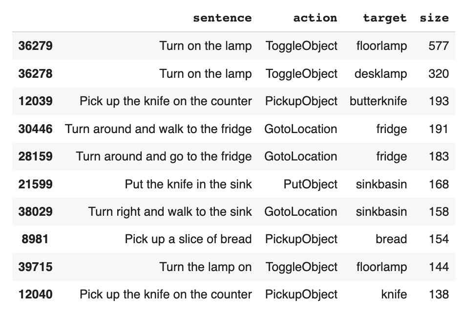
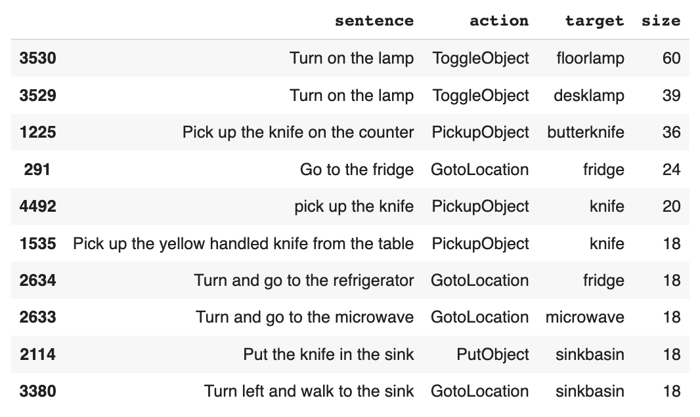
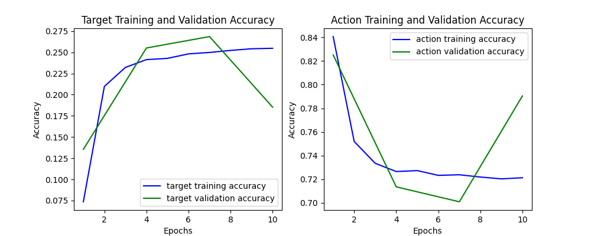

# Introduction
This repository implements a Vanila LSTM to learn ALFRED (Action Learning From Realistic Environments and Directives) dataset. This dataset contains a set of instructions given to a human to achieve a specific task such as grapping a cup or finding a mat. It also includes for each instruction the target object like (mat, cup, knife .. etc) and the action done (gotolocation, putobject .. etc).

# Experiments
## Data
The first pipeline in any Machine Learning task is to explore and process the data. So here are my findings:

- Lowering all cases had a big effect on model performance since it increases the vocabulary coverage with no loss of information such as in stemming or removing stop words. 

- Lemmatization and stemming didn't change the models performance. It seems that the sentences are short an average of 14 words, so the instruction actions is always similar.

- Removing stop words didn't change the models performance.

- The target object records were not consistent, that's why the model had difficulty to learn the pattern in the data. You can see in some of the examples in the table below how the targets (desklamp) and (floorlamp) share the same sentence as in the first two table records. Same thing for the last two; they are almost the sentence with different target objects. This made target difficult to learn:
    
    | Sentence      | target |
    | ----------- | ----------- |
    | Turn on the lamp	      | floorlamp       |
    | Turn on the lamp	   | desklamp        | |
    | Pick up the knife from the counter	   | butterknife        |
    | Pick up the knife on the counter	      | knife       |

- Removing duplicate records made the model accuracy lower than keeping them. Because the training and validation sets are almost the same kind of instructions, so when keeping the duplicate records the model tend to learn more about these records which are going to be also popular in the validation set. It's a trad-off that needs to be tested on production systems. Since the tasks are similar, most probably the instructions given will be similar also, that's why we have duplicate records.

The first two records in the tables below are an example of duplicates:

An example of validation duplicates:

The first two records are the exact same sentences with the same action and target.

## Neural Network Design

The archeticture of the model is:

        NavigationLSTM(
        (embedding): Embedding(1000, 300)
        (lstm): LSTM(7500, 128, num_layers=2, batch_first=True, dropout=0.33)
        (fc): Linear(in_features=128, out_features=64, bias=True)
        (linear): Linear(in_features=64, out_features=8, bias=True)
        (linear): Linear(in_features=64, out_features=80, bias=True)
        )
 
- Vocab size 1000 was suitable enough to cover important vocab in the dataset, since the vocab used in giving instructions is very similar to each other, so 1000 was good enough to cover the important words.
- Embedding dimension: wasn't a big factor in changin the model's performance, so I just chose a common number.
- Prediction Head: I added two linear layers at the end, one to predict the target which contains 80 classes, and another head to predict the action which has 8 classes. Having a seperate model for each task performed much better than one model for two prediction tasks, reasons are shared in the result discussion section.
- Optimiztion: the SGD was struggling to minimize the loss of the target prediction, while Adam sky rocketed the performance.
- Hyperparamters: 
    - Dropout: since we have a lot of duplicates and short sentences the model tends to overfit so I added to a dropout rate to mitigate this issue. 
    - Embedding Dim and LSTM hidden Dim didn't have a huge effect so  I just chose a common number.
    - Learning rate as well, just chose a common number.
    - weight decay was helpful to regularize the model when training on the traget. The model was overfitting with time, the training accuracy goes higher but the validation accuracy goes lower, regularization mitigated this effect. 
    
## Results Discussion

- Training the model seperately on Target and on Action performs way better with an accuracy of 75% and 98% conecutively. However, when training the model with multiple heads and optimizing for both losses the model decays in performance, resulting in 70% for action and 27% for target.

- I noticed the training data has plenty of duplicate records. When keeping the duplicates the model performs way better then removing them specially for predicting the target. The reason is that the training and validation sets both have similar sentences. Since, it's given as a navigation guide for people to achieve a specific task the set of instructions is always similar. So, the model tends to overfit on the existing training data, and the validation set has the same distribution, so the model performs pretty well. But if there was a distribution shift I guess that the model will degrade.

- Glove embeddings gave an accuracy increase at the begning, but when the weights got updated the model started degrading arriving to the same accuracy without Glove embeddings. The reason is that the model is adjusting the weights to increase the Target accuracy which is affecting Action accuracy as you can see in the below figure. I tried to frize the GloVe embeddings to see if the accuracy becomes better, since only the LSTM and fully connected layer (fc) weights will be adjusted, but that was not the case.

# Run the code

- Removing Duplicates, Lemmatizing Words, All Words to Lower Case

        python3 train.py --in_data_fn=lang_to_sem_data.json --batch_size=100 --num_epochs=10 --val_every=3 --learning_rate=0.005 --embedding_dim=100 --dropout=0.33 --lstm_hidden_dim=256 --lstm_layers=2 --linear_output_dim=64 --weight_decay=0.0001 --force_cpu --remove_dup --lemmatize_words --all_lower

- Lemmatizing Words, All Words to Lower Case

        python3 train.py --in_data_fn=lang_to_sem_data.json --batch_size=100 --num_epochs=10 --val_every=3  --learning_rate=0.005 --embedding_dim=100 --dropout=0.33 --lstm_hidden_dim=256 --lstm_layers=2 --linear_output_dim=64 --weight_decay=0.0001 --force_cpu --lemmatize_words --all_lower

-- Lemmatizing Words, All Words to Lower Case, Glove embeddings; note the embedding_dim should be 300 and you need to download the glove embeddings in the same directory for the code to run

        python3 train.py --in_data_fn=lang_to_sem_data.json --batch_size=100 --num_epochs=10 --val_every=3 --learning_rate=0.005 --embedding_dim=300 --dropout=0.33 --lstm_hidden_dim=128 --lstm_layers=2 --linear_output_dim=64 --weight_decay=0.0001 --force_cpu --remove_dup --glove
